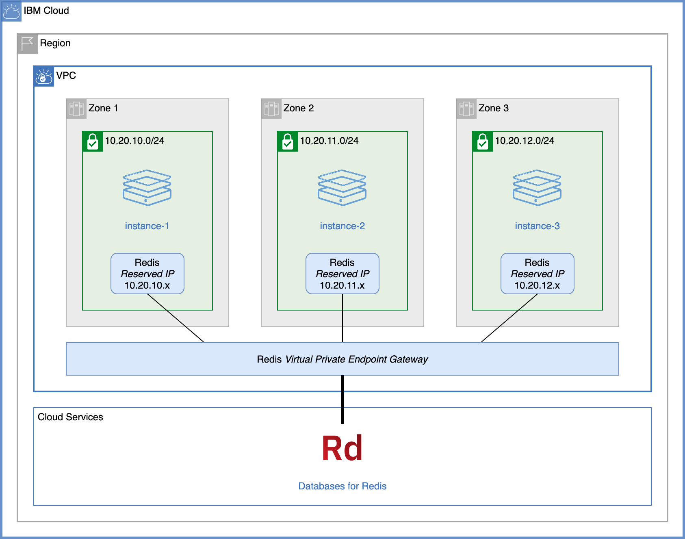

# Creating virtual private endpoints with terraform

This sample shows how to provision virtual private endpoint gateways from terraform.



## Deploy all resources

1. Copy `terraform.tfvars.template` to `terraform.tfvars`:
   ```
   cp terraform.tfvars.template terraform.tfvars
   ```
1. Edit `terraform.tfvars` to match your environment.
1. Make sure you have Terraform 0.14 installed. Use [`tfswitch`](https://tfswitch.warrensbox.com/) to easily move between Terraform versions.
1. Run terraform:
   ```
   terraform init
   terraform apply
   ```

## Test virtual private endpoints

The script `lookup.sh` iterates over all provisioned virtual server instances and does a `dig` to resolve the IP addresses of Redis, Object Storage and Key Protect.

In the first `apply`, VPE is not yet enabled, only cloud service endpoints are.

1. Run `./lookup.sh` to show how the virtual server instances are resolving endpoints. Here is an excerpt for the first instance:

   | Source | Destination | Resolved IPs |
   | ------ | ----------- | ------------ |
   | vpe-example-instance-1 | redis (123456.private.databases.appdomain.cloud) |  166.9.16.93,166.9.12.115,166.9.14.76 |
   | vpe-example-instance-1 | cos (s3.direct.us-south.cloud-object-storage.appdomain.cloud) |  161.26.0.34 |
   | vpe-example-instance-1 | kms (private.us-south.kms.cloud.ibm.com) |  166.9.250.227,166.9.250.195,166.9.251.3 |

1. Edit `terraform.tfvars`, add `use_vpe = true` and save.
1. Apply `terraform` again:
   ```
   terraform apply
   ```
1. After a short while, run `./lookup.sh` again to see the VPE Reserved IPs allocated to the services. Here is an excerpt for the first instance:

   | Source | Destination | Resolved IPs |
   | ------ | ----------- | ------------ |
   | vpe-example-instance-1 | redis (123456.private.databases.appdomain.cloud) |  10.20.10.9 |
   | vpe-example-instance-1 | cos (s3.direct.us-south.cloud-object-storage.appdomain.cloud) |  10.20.10.10 |
   | vpe-example-instance-1 | kms (private.us-south.kms.cloud.ibm.com) |  10.20.10.8 |

   **Notice how the hostnames now resolve to private IPs within the VPC.**

## Destroy all configuration

To destroy the environment:
   ```
   terraform destroy
   ```
